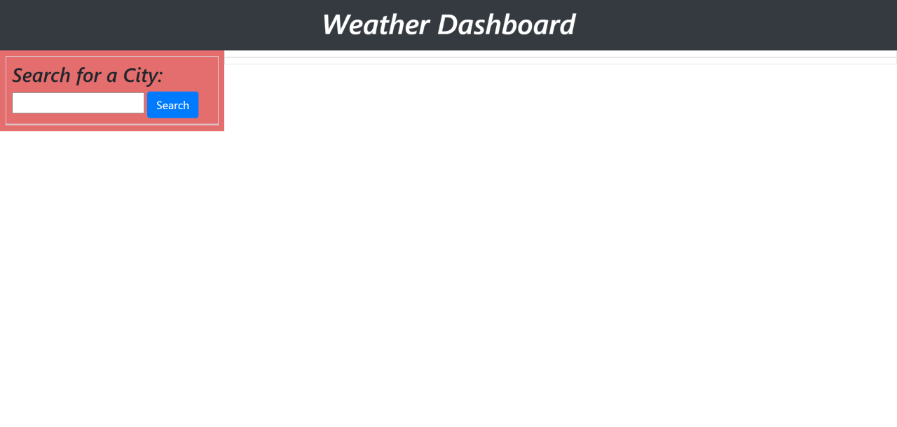
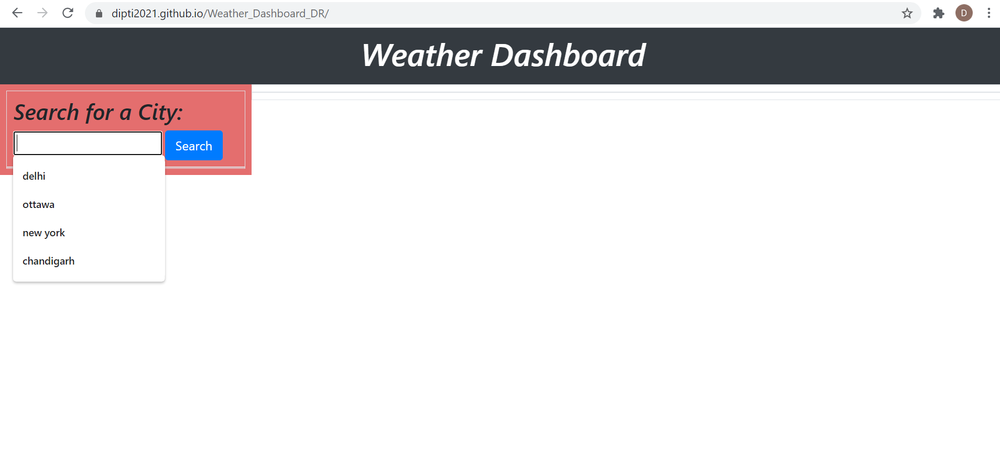
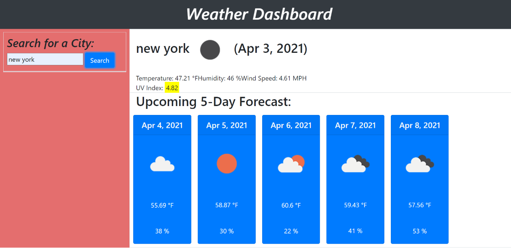

# Weather_Dashboard_DR
Weather Dashboard using open weather API.

## Table of Contents
* [Introduction](#introduction)
* [Screenshot of the Application](#webpage)
* [Working of the Application](#web)
* [Installations](#installations)
* [Libraries taken](#details)
* [Credits](#credits)

 ## Introduction 
This dashboard is created to  find the present day temperature and the weather conditions for any given city in the world. Also, it will display the same details for the coming fice days as well.  The name of the citiescan be stored in the local storage and the user can go back and forth and click on any of his previously selected cities again to check the temperature details as many times as he wants.
 
 
 ## Screenshot of the Application
 The screenshot of the application looks almost similar to the one as shown here.

 
 
 
 
 
 
 
 
 ## Working of the Application
 * In this dashboard, the user enters the __name of a city__ in the __search field__ which will be displayed on the left side of the page.
 * On __clicking__ the search button, the __present day weather conditions__ will be displayed in front of him .The conditions being temperature, humidity, UV index, and a picture representingthe weather.
 *  Under this display, a __5-day forecast__ for the same city will also be displayed for the same conditions.
 * The data for all the cities will be stored in the __local storage__, that means if the user closes the window or refreshes the browser, the search history will still contain all the old city names and their details entered.
 
   
 
 
 ## Installations
   * [The URL of the Github repo](https://github.com/Dipti2021/Weather_Dashboard_DR)
   * [The URL of the deployed application](https://dipti2021.github.io/Weather_Dashboard_DR/)
 

  *Keeping all these conditions in mind, I have created the Javascript code along with  taking the code snippets taken from various libraries*
  
 ## Libraries Used
   * [Bootstrap](https://getbootstrap.com/).
   * [jQuery](https://jquery.com/).
   * [moment.js](https://momentjs.com/).
   * [OpenWeather API](https://openweathermap.org/api).

 ## Credits
    The homework has been assigned to me by the Carleton University Coding Bootcamp, our instructor and the TA's
   
